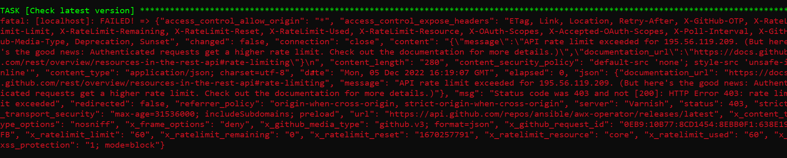

# How to install AWX Ansible
This manual describes how to install AWX ansible on windows or Linux OS
# Install AWX Ansible using VirtualBox and Vagrant
## Install VirtualBox
Download installation for your OS from [here] (https://www.virtualbox.org/wiki/Downloads)

Choose your OS from binary platform packages.
  
## Install Vagrant
Download installation frpm [here] (https://developer.hashicorp.com/vagrant/downloads)
Follow install instructions for your OS

### Setup VM for AWX Ansible

Make new folder *Vagrant*
Download vagrantfile from: and copy it to the just created folder *Vagrant* folder  
Run cmd.exe via run command
```bash
cd c:\vagrant
vagrant up
```
After VM setup finishes work run
```bash
vagrant ssh
```
Inside VM run commands:

```bash
git clone https://github.com/zukudm/awx.git
cd awx
ansible-galaxy install -r roles/requirements.yml
ansible-playbook install-docker.yml
```
Log out from VM (exit or Ctrl-d) then login again
```bash
vagrant ssh
```
Inside VM run
```bash
cd awx
ansible-playbook install-awx.yml
```
#### Possible error:

In case task "Check latest version" fails, run *ansible-playbook install-awx.yml* once again
<details>

 </details>
 

In case install-awx get any errors wait for some time (it could take several hours) run  
```bash
kubectl get pod --namespace=ansible-awx
```
Whell all 3 applications (Awx-perator, ansible-awx*) will be in ready state, you will be able to finish setup with
(It won't ryn if one of them status will be smth like Init:Imagexxxxxx)
```bash
ansible-playbook finish_install-awx.yml
```

