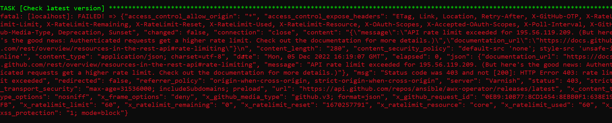
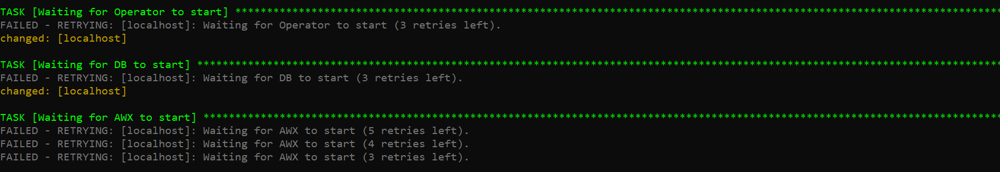
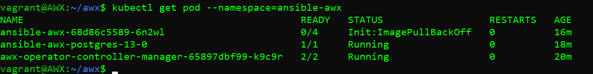
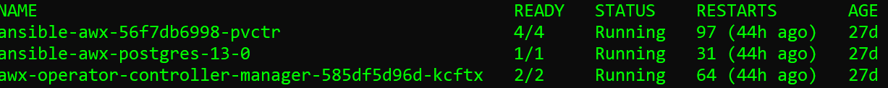

# How to install AWX Ansible
This manual describes how to install AWX Ansible on a virtual vm inside Windows or macOS

Also, it's possible to install AWX Ansible on different Linux distributions.

# Install AWX Ansible using VirtualBox and Vagrant
## Minimum requirements 

### Hardware
6 GB RAM (You can try with 4 GB after changing Vagrantfile)

15 GB HDD

1 CPU
### Software
Vagrant
VirtualBox

## Install VirtualBox
Download the installation for your OS from [here](https://www.virtualbox.org/wiki/Downloads)

Choose your OS from binary platform packages.
  
## Install Vagrant
Download the installation from [here](https://developer.hashicorp.com/vagrant/downloads)
Follow the install instructions for your OS

### Setup VM for AWX Ansible

Make a new folder *Vagrant*
Download Vagrantfile from: [here](https://raw.githubusercontent.com/zukudm/awx/main/vagrant/Vagrantfile)

Copy that file to the just created *Vagrant* folder  
Run cmd.exe using the run command
```bash
cd c:\vagrant
vagrant up
```
After the VM setup finishes work run
```bash
vagrant ssh
```

### Run AWX Ansible

```bash
git clone https://github.com/zukudm/awx.git
cd awx
ansible-galaxy install -r roles/requirements.yml
ansible-playbook install-docker.yml
```
Log out from VM (exit or Ctrl-d) then login again
```bash
vagrant ssh
```

In the case of Linux installation, use your ssh username to connect

Inside VM run
```bash
cd awx
ansible-playbook install-awx.yml
```
In case of success, you will gate admin password and how to connect to the AWX ansible 

http://127.0.0.1:10445

#### Possible problems:

In case the task "Check the latest version" fails, run *ansible-playbook install-awx.yml* once again after "some time"
 <details>
 
   <summary> Error example </summary>
 
  </details>
  
One of the longest tasks is *Waiting for AWX to start*
<details>
 <summary> Log example </summary>
 
</details>

In case that task fails, you have to wait (???)
<details>
 <summary> Error example </summary>
 
</details>

After some time we can check the AWX status using the command
```bash
kubectl get pod --namespace=ansible-awx
```
All statuses must be in *Running* state

In case one of them is not

<details>
 <summary> Error example </summary>
 
</details>

We have to wait more o run the script *ansible-playbook install-awx.yml" again

When all 3 applications (Awx-operator, ansible-awx*) will be in *running* state
<details>
 <summary> Log example </summary>
 
</details>

 You will be able to finish setup with
(It won't run if one of their status will be smth like Init:Imagexxxxxx)
```bash
cd awx
ansible-playbook finish_install-awx.yml
```
You won't need to finish setup if *ansible-playbook install-awx.yml* finishes without errors

# Install AWX Ansible on Linux
<details>

## Minimum requirements 

### Hardware
6 GB RAM (You can try with 4 GB)

15 GB HDD

1 CPU
### Software
Ubuntu< Debian, Fedora, Centos and possibly other Linux

## Install ansible


Follow instructions 
https://docs.ansible.com/ansible/latest/installation_guide/installation_distros.html

Then follow Install AWX Ansible using VirtualBox and Vagrant step *Run AWX Ansible*
</details>

# AWX Ansible usage

## Connecting to AWX

AWX Ansible is preconfigured to be accessible via URL http://127.0.0.1:10445

In case you miss the password run script get_password_awx.yml inside you VM

```bash
cd awx
ansible-playbook get-password-awx.yml
```

## Getting started

### Define Inventories

Select "Inventories" from the left menu, press "ADD"/"Add Inventory"
Define "Name" 

It's recommended to create separate inventory for every resource provider (For example Hetzner)

Otherwise, you can use the existing "Demo inventory"

### Define Hosts

This section will define all Linux boxes/servers.


Select "Hosts" from the left menu, press "ADD"

Define "Name" using Linux box IP address
Select the Inventory, which was defined in the previous step from the "Inventory" field

In the "Variables" box add the line
ansible_user: root
Don't remove the first line "---"

In case you have got another user then root, use that user instead of root

### Define Project


This section will define a group of playbook/scripts for node or system tools

To find the list of existing nodes go [here](https://github.com/zukudm)

Select the project and get its link from "Code"/"HTTPS" copy the link 

Select "Projects" from the left menu, press "ADD"

Define the "Name" field (let it be similar to the selected project)

Select the "Git" value from "Source Control Type"

Paste the recently copied link to the "Source Control URL" field

Finish pressing the "Save" button

### Define Credentials

This section will define username and password, which will be used to connect and install the soft
You can use one username/password for every Linux box or just one for all.

Select "Credentials" from the left menu, press "ADD"

Define the "Name" field. It is recommended that the field "Name" should have a unique and clear name.

Select the "Machine" value from "Credential type"

Input value for the "Username" field (This is a user provided to you to connect to the Linux box, should be the same as the ansible_user value, for example, root)


Input password for "Password" field (This value can't be viewed after, it will be possible only to change it later)

Finish pressing the "Save" button


### Define Template

This section will define how to run/launch node or Helping/system tools
Don't forget your Linux box should have Docker installed before running any node. Define template from Helping/System tools project???

Select "Templates" from the left menu, press "ADD"

Define the "Name" field

Select the "Run" value from the "Job Type" field

Select Inventory from the "Inventory" field

Select Project from the "Project" field

Select playbook from the "Playbook" field (Usually node setup playbook/script will have nodename_setup_awx or nodename_setup_multi names


Select Credentials from the "Credentials" field (Select username for the Linux box where you are going to run that playbook/script)

Also, you have to define the "Variables" box with several variables (Don't remove the first line with ---)

```bash
host: x.x.x.x
```

Where x.x.x.x is your Linux box 
If you are going to run several instances for the same node using *multi playbook/script you will need to define more variables
and variables will look like

```bash
host: x.x.x.x
container_name: pathfinder_node1
volume_name: pathfinder_volume1
```

You will need to define as many templates for the same playbook/script as you need the same copies of the node 

```bash
host: x.x.x.x
container_name: pathfinder_node2
volume_name: pathfinder_volume2
```

Finish pressing the "Save" button

Finally, to launch the playbook select the "Launch template" and "rocket" symbol


